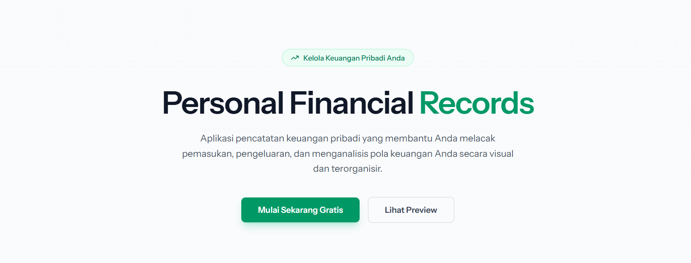
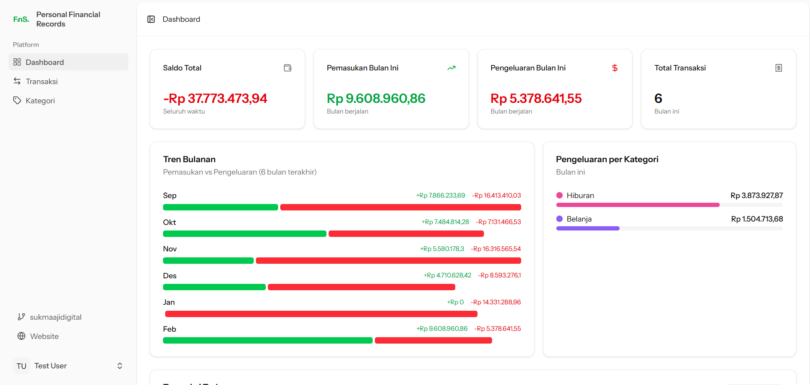

<p align="center">
  
</p>

<h1 align="center">Personal Financial Records</h1>

<p align="center">
  A modern, full-stack personal finance management application built with Laravel 12, Vue 3, and Inertia.js. Track your income and expenses, categorize transactions, and visualize your financial health — all in a beautiful, responsive UI.
</p>

<p align="center">
  <a href="#features">Features</a> •
  <a href="#tech-stack">Tech Stack</a> •
  <a href="#prerequisites">Prerequisites</a> •
  <a href="#installation">Installation</a> •
  <a href="#usage">Usage</a> •
  <a href="#testing">Testing</a> •
  <a href="#contributing">Contributing</a> •
  <a href="#security">Security</a> •
  <a href="#license">License</a>
</p>

---

## Screenshots

|        Landing Page        |         Dashboard         |
| :------------------------: | :-----------------------: |
|  |  |

---

## Features

### Core Financial Management

- **Transaction Tracking** — Record income and expense transactions with descriptions, amounts, dates, and categories.
- **Category Management** — Create, edit, and color-code custom categories for organizing transactions.
- **Dashboard Analytics** — View monthly summaries (total income, expenses, balance, transaction count), 6-month trend charts, expense breakdown by category, and recent transactions.
- **Advanced Filtering** — Filter transactions by keyword search, type (income/expense), category, and date range with paginated results.

### Authentication & Security

- **User Registration & Login** — Secure authentication powered by Laravel Fortify.
- **Email Verification** — Verify user email addresses before accessing protected features.
- **Two-Factor Authentication (2FA)** — TOTP-based 2FA with QR code setup, OTP input, and recovery codes.
- **Password Reset** — Forgot password flow with email-based reset links.
- **Password Confirmation** — Re-authentication for sensitive actions.

### User Settings

- **Profile Management** — Update name and email address.
- **Password Update** — Change password with current password verification.
- **Appearance Settings** — Toggle between light, dark, and system theme modes.
- **Two-Factor Settings** — Enable, disable, and manage 2FA from a dedicated settings page.
- **Account Deletion** — Permanently delete account with confirmation.

### User Experience

- **Responsive Design** — Fully responsive layout with collapsible sidebar navigation.
- **Dark Mode** — System-aware dark mode with manual override.
- **Real-time Validation** — Client-side and server-side form validation with inline error messages.
- **Flash Messages** — Success and error notifications after actions.
- **SPA Navigation** — Seamless page transitions powered by Inertia.js (no full page reloads).
- **Type-safe Routing** — Auto-generated route helpers via Laravel Wayfinder.
- **PWA Ready** — Includes `manifest.json` and service worker for installable web app support.

---

## Tech Stack

### Backend

| Technology                                                | Version | Purpose                      |
| --------------------------------------------------------- | ------- | ---------------------------- |
| [PHP](https://www.php.net/)                               | 8.2+    | Runtime                      |
| [Laravel](https://laravel.com/)                           | 12.x    | PHP Framework                |
| [Laravel Fortify](https://laravel.com/docs/fortify)       | 1.x     | Authentication backend       |
| [Inertia.js (server)](https://inertiajs.com/)             | 2.x     | SPA bridge (server adapter)  |
| [Laravel Wayfinder](https://github.com/laravel/wayfinder) | 0.1.x   | Auto-generated route helpers |

### Frontend

| Technology                                    | Version     | Purpose                     |
| --------------------------------------------- | ----------- | --------------------------- |
| [Vue 3](https://vuejs.org/)                   | 3.5         | Reactive UI framework       |
| [TypeScript](https://www.typescriptlang.org/) | 5.x         | Type-safe JavaScript        |
| [Inertia.js (client)](https://inertiajs.com/) | 2.x         | SPA bridge (client adapter) |
| [Tailwind CSS](https://tailwindcss.com/)      | 4.x         | Utility-first CSS           |
| [shadcn-vue](https://www.shadcn-vue.com/)     | New York v4 | UI component library        |
| [Reka UI](https://reka-ui.com/)               | 2.x         | Headless UI primitives      |
| [Lucide Icons](https://lucide.dev/)           | Latest      | Icon library                |
| [TanStack Table](https://tanstack.com/table)  | 8.x         | Headless table utilities    |
| [VueUse](https://vueuse.org/)                 | 12.x        | Vue composition utilities   |

### Build & Tooling

| Tool                                          | Version | Purpose                                 |
| --------------------------------------------- | ------- | --------------------------------------- |
| [Vite](https://vite.dev/)                     | 7.x     | Frontend build tool                     |
| [Pest](https://pestphp.com/)                  | 4.x     | PHP testing framework                   |
| [Laravel Pint](https://laravel.com/docs/pint) | 1.x     | PHP code style fixer (PSR-12 / Laravel) |
| [ESLint](https://eslint.org/)                 | 9.x     | JavaScript/Vue linter                   |
| [Prettier](https://prettier.io/)              | 3.x     | Code formatter                          |

---

## Architecture

```
app/
├── Actions/Fortify/          # Fortify action classes (registration, password reset)
├── Concerns/                  # Shared traits (validation rules)
├── Http/
│   ├── Controllers/           # Resourceful controllers
│   │   └── Settings/          # Settings controllers (Profile, Password, 2FA)
│   ├── Middleware/             # Inertia & appearance middleware
│   └── Requests/              # Form request validation classes
├── Models/                    # Eloquent models (User, Category, Transaction)
├── Policies/                  # Authorization policies (Category, Transaction)
└── Providers/                 # Service providers (App, Fortify)

resources/js/
├── pages/                     # Inertia page components
│   ├── auth/                  # Auth pages (Login, Register, ForgotPassword, etc.)
│   ├── categories/            # Category management pages
│   ├── transactions/          # Transaction CRUD pages
│   ├── settings/              # User settings pages
│   ├── Dashboard.vue          # Main dashboard
│   └── Welcome.vue            # Landing page
├── components/                # Reusable Vue components
│   └── ui/                    # shadcn-vue primitives (do not edit manually)
├── composables/               # Vue composables (useAppearance, useTwoFactorAuth, etc.)
├── layouts/                   # Layout components (App, Auth, Settings)
├── types/                     # TypeScript type definitions
├── lib/                       # Utilities (cn(), toUrl())
├── wayfinder/                 # Auto-generated route helpers (do not edit)
└── app.ts                     # Application entry point

database/
├── factories/                 # Model factories for testing & seeding
├── migrations/                # Database schema migrations
└── seeders/                   # Database seeders (User, Category, Transaction)

tests/
├── Feature/                   # Feature (integration) tests
│   ├── Auth/                  # Authentication tests
│   ├── Settings/              # Settings tests
│   └── DashboardTest.php      # Dashboard tests
└── Unit/                      # Unit tests
```

### Database Schema

```
┌──────────────┐       ┌──────────────────┐       ┌──────────────────┐
│    users     │       │   categories     │       │  transactions    │
├──────────────┤       ├──────────────────┤       ├──────────────────┤
│ id           │──┐    │ id               │──┐    │ id               │
│ name         │  │    │ user_id (FK)     │  │    │ user_id (FK)     │
│ email        │  ├───>│ name             │  ├───>│ category_id (FK) │
│ password     │  │    │ color            │  │    │ description      │
│ 2fa_secret   │  │    │ timestamps       │  │    │ amount (15,2)    │
│ 2fa_recovery │  │    └──────────────────┘  │    │ type (enum)      │
│ timestamps   │  │                          │    │ date             │
└──────────────┘  │                          │    │ timestamps       │
                  └──────────────────────────┘    └──────────────────┘
```

- **Users** → has many Categories, has many Transactions
- **Categories** → belongs to User, has many Transactions
- **Transactions** → belongs to User, belongs to Category
- Transaction `type` is an enum: `income` or `expense`
- Transaction `amount` supports up to 15 digits with 2 decimal places
- All foreign keys cascade on delete

---

## Prerequisites

Before you begin, ensure you have the following installed:

- **PHP** >= 8.2 with extensions: `mbstring`, `xml`, `ctype`, `json`, `bcmath`, `pdo`, `tokenizer`
- **Composer** >= 2.x
- **Node.js** >= 20.x
- **npm** >= 10.x
- **MySQL** >= 8.0 (or MariaDB >= 10.6, SQLite for development)
- **Git**

---

## Installation

### 1. Clone the Repository

```bash
git clone https://github.com/sukmaajidigital/personal-financial-records.git
cd personal-financial-records
```

### 2. Quick Setup (Recommended)

Run the all-in-one setup command:

```bash
composer setup
```

This will:

- Install PHP dependencies (`composer install`)
- Copy `.env.example` to `.env` (if not exists)
- Generate application key
- Run database migrations
- Install Node.js dependencies (`npm install`)
- Build frontend assets (`npm run build`)

### 3. Manual Setup

If you prefer step-by-step:

```bash
# Install PHP dependencies
composer install

# Copy environment file
cp .env.example .env

# Generate application key
php artisan key:generate

# Configure your database in .env
# DB_CONNECTION=mysql
# DB_HOST=127.0.0.1
# DB_PORT=3306
# DB_DATABASE=personal_financial_records
# DB_USERNAME=root
# DB_PASSWORD=

# Run migrations
php artisan migrate

# (Optional) Seed the database with sample data
php artisan db:seed

# Install Node.js dependencies
npm install

# Build frontend assets
npm run build
```

### 4. Configure Environment

Edit the `.env` file to match your local environment:

```dotenv
APP_NAME="Personal Financial Records"
APP_URL=http://localhost:8000

DB_CONNECTION=mysql
DB_DATABASE=personal_financial_records
DB_USERNAME=root
DB_PASSWORD=your_password

MAIL_MAILER=smtp
MAIL_HOST=mailpit
MAIL_PORT=1025
```

---

## Usage

### Development Server

Start all development services (web server, queue worker, and Vite dev server) with a single command:

```bash
composer dev
```

This starts:

- **Laravel development server** at `http://localhost:8000`
- **Queue worker** for background jobs
- **Vite dev server** with hot module replacement (HMR)

### SSR Development (Optional)

For server-side rendering:

```bash
composer dev:ssr
```

### Build for Production

```bash
npm run build
```

### Common Artisan Commands

```bash
# Run database migrations
php artisan migrate

# Seed the database
php artisan db:seed

# Rollback and re-run all migrations with seeding
php artisan migrate:fresh --seed

# Clear all caches
php artisan optimize:clear

# Generate IDE helper files
php artisan boost:update
```

---

## Testing

This project uses [Pest](https://pestphp.com/) as the testing framework with SQLite in-memory database.

### Run All Tests

```bash
composer test
```

This will:

1. Clear configuration cache
2. Run PHP code style checks (Pint)
3. Execute all Pest tests

### Run Tests Only (Without Lint)

```bash
php artisan test
```

### Run Specific Test Suite

```bash
# Feature tests only
php artisan test --testsuite=Feature

# Unit tests only
php artisan test --testsuite=Unit

# Run a specific test file
php artisan test tests/Feature/DashboardTest.php

# Run with filter
php artisan test --filter="it can view dashboard"
```

### Test Coverage

```bash
php artisan test --coverage
```

---

## Code Quality

### PHP Linting (Laravel Pint)

```bash
# Fix code style issues
composer lint

# Check for issues without fixing
composer test:lint
```

### JavaScript/Vue Linting (ESLint)

```bash
# Fix lint issues
npm run lint
```

### Code Formatting (Prettier)

```bash
# Format all frontend files
npm run format

# Check formatting without fixing
npm run format:check
```

---

## Project Configuration

### Tailwind CSS v4

Tailwind is configured via CSS in `resources/css/app.css` (not a JS config file). Theme customization uses CSS custom properties for light/dark mode support.

### shadcn-vue

UI components use the **New York v4** style with Reka UI primitives. Components are located in `resources/js/components/ui/`.

> ⚠️ **Do not manually edit** files in `components/ui/`. Use the shadcn-vue CLI to add or update components:
>
> ```bash
> npx shadcn-vue@latest add button
> ```

### Wayfinder

Route helpers are auto-generated by the Wayfinder Vite plugin. Files in `resources/js/wayfinder/`, `resources/js/actions/`, and `resources/js/routes/` are **auto-generated** — do not edit manually.

---

## API Routes Reference

### Public Routes

| Method | URI | Description  |
| ------ | --- | ------------ |
| `GET`  | `/` | Landing page |

### Authentication (Laravel Fortify)

| Method | URI                                | Description               |
| ------ | ---------------------------------- | ------------------------- |
| `GET`  | `/login`                           | Login page                |
| `POST` | `/login`                           | Authenticate user         |
| `POST` | `/logout`                          | Logout                    |
| `GET`  | `/register`                        | Registration page         |
| `POST` | `/register`                        | Register new user         |
| `GET`  | `/forgot-password`                 | Forgot password page      |
| `POST` | `/forgot-password`                 | Send reset link           |
| `GET`  | `/reset-password/{token}`          | Reset password page       |
| `POST` | `/reset-password`                  | Reset password            |
| `GET`  | `/email/verify`                    | Email verification notice |
| `GET`  | `/email/verify/{id}/{hash}`        | Verify email              |
| `POST` | `/email/verification-notification` | Resend verification       |
| `GET`  | `/two-factor-challenge`            | 2FA challenge page        |
| `POST` | `/two-factor-challenge`            | Verify 2FA code           |

### Dashboard (Authenticated)

| Method | URI          | Description              |
| ------ | ------------ | ------------------------ |
| `GET`  | `/dashboard` | Dashboard with analytics |

### Categories (Authenticated)

| Method   | URI                      | Description         |
| -------- | ------------------------ | ------------------- |
| `GET`    | `/categories`            | List all categories |
| `POST`   | `/categories`            | Create a category   |
| `PUT`    | `/categories/{category}` | Update a category   |
| `DELETE` | `/categories/{category}` | Delete a category   |

### Transactions (Authenticated)

| Method   | URI                                | Description                               |
| -------- | ---------------------------------- | ----------------------------------------- |
| `GET`    | `/transactions`                    | List transactions (filterable, paginated) |
| `GET`    | `/transactions/create`             | Create transaction form                   |
| `POST`   | `/transactions`                    | Store a transaction                       |
| `GET`    | `/transactions/{transaction}/edit` | Edit transaction form                     |
| `PUT`    | `/transactions/{transaction}`      | Update a transaction                      |
| `DELETE` | `/transactions/{transaction}`      | Delete a transaction                      |

### Settings (Authenticated)

| Method   | URI                    | Description                        |
| -------- | ---------------------- | ---------------------------------- |
| `GET`    | `/settings`            | Redirect to profile                |
| `GET`    | `/settings/profile`    | Edit profile                       |
| `PATCH`  | `/settings/profile`    | Update profile                     |
| `DELETE` | `/settings/profile`    | Delete account                     |
| `GET`    | `/settings/password`   | Password settings                  |
| `PUT`    | `/settings/password`   | Update password                    |
| `GET`    | `/settings/appearance` | Appearance settings                |
| `GET`    | `/settings/two-factor` | Two-factor authentication settings |

---

## Contributing

We welcome contributions! Please see [CONTRIBUTING.md](CONTRIBUTING.md) for detailed guidelines on how to contribute to this project.

---

## Security

If you discover a security vulnerability, please review our [Security Policy](SECURITY.md) for responsible disclosure instructions. **Do not open a public issue for security vulnerabilities.**

---

## License

This project is open-sourced software licensed under the [MIT License](LICENSE).

---

## Acknowledgments

- [Laravel](https://laravel.com/) — The PHP framework for web artisans
- [Vue.js](https://vuejs.org/) — The progressive JavaScript framework
- [Inertia.js](https://inertiajs.com/) — The modern monolith
- [Tailwind CSS](https://tailwindcss.com/) — A utility-first CSS framework
- [shadcn-vue](https://www.shadcn-vue.com/) — Re-usable Vue components
- [Pest](https://pestphp.com/) — Testing with style
- [Lucide](https://lucide.dev/) — Beautiful open-source icons

---

<p align="center">
  Made with ❤️ using Laravel, Vue, and Inertia.js
</p>
